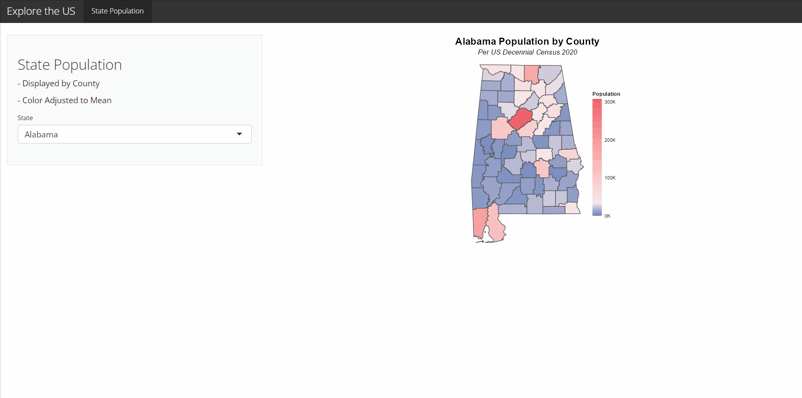

# My First Shiny App

I design and deploy my first web app in R using the {shiny} package and framework.

## Description

Web apps are a powerful solution to the headache of how data is put in the hands of users. I've been interested in improving my skills to deploy data tools via the 
web for scalable and accessible solutions. This is my first app!

I access county population data by state and display a visualization customized to each state's median. Users may select a state and evaluate which counties are
over-/under-populated. Full details of the build can soon be referenced via the link below.

## Core Packages Used

{shiny} for the web app framework and deployment

{tidyverse} for data transformation and visualization tools

{tigris} for shape files and population data

## Blog Post
Link coming soon!
